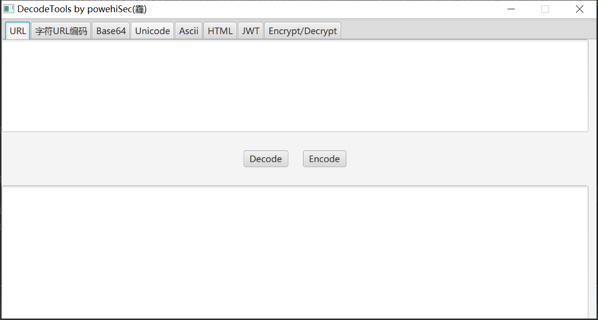

# DecodeTools

## 功能介绍

集合各种编码解码方式以及AES/DES加解密工具。

1. URL编码解码.
2. 字符URL编码: 对所有字符进行URL编码.
3. Base64编码解码.
4. Unicode编码解码.
5. Ascii<->十进制、十六进制，编码解码.
6. HTML<->十进制、十六进制形式，实体编码、解码.
7. JWT解密、密钥爆破.
8. AES、DES加解密.

## 截图

